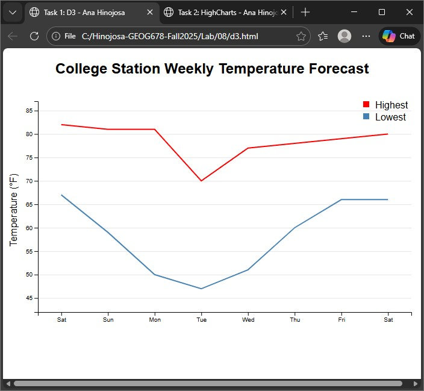
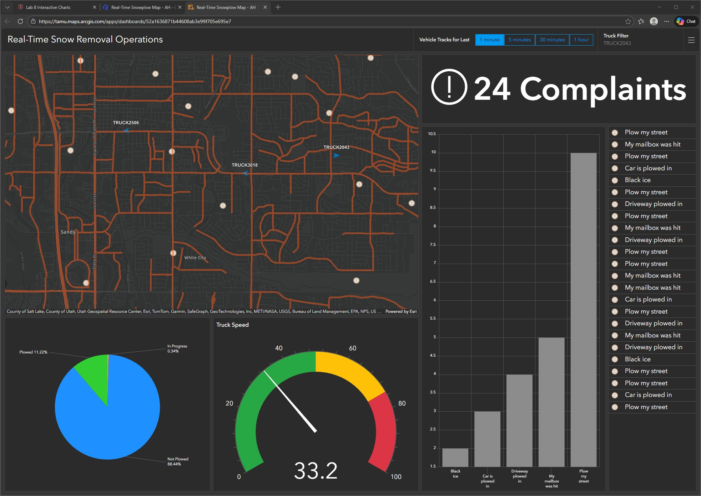

## Lab 8
### Ana Hinojosa
#### Interactive Charts
##### Task 1: D3 Chart:

##### Task 2: HighCharts: 

##### Task 3: Dashboard Link: https://www.arcgis.com/apps/dashboards/52a1636871b44608ab3e99f705e695e7: 

#### References:
- [D3 Line Chart](https://observablehq.com/@d3/line-chart/2)
- [How to Create a Simple Real-Time Dashboard](https://community.esri.com/t5/arcgis-dashboards-blog/how-to-create-a-simple-real-time-dashboard/ba-p/888719)
- [Highcharts - Monthly Average Temperature](https://jsfiddle.net/kat52px1/)